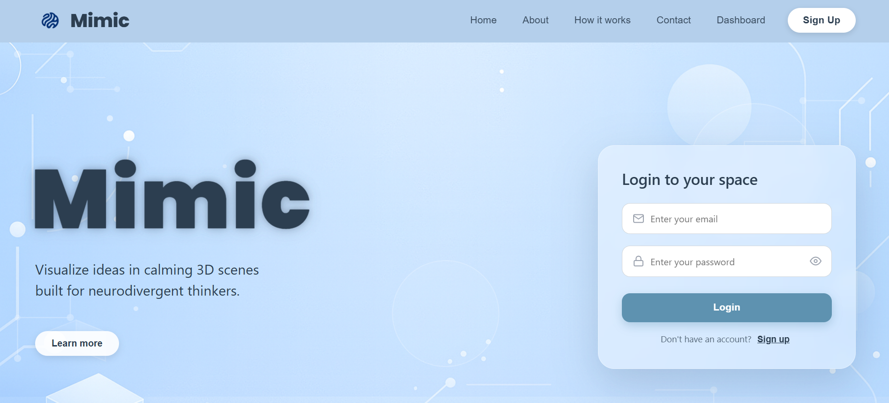
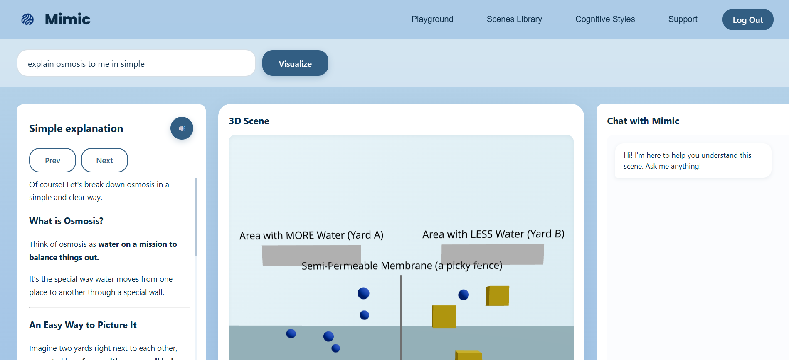
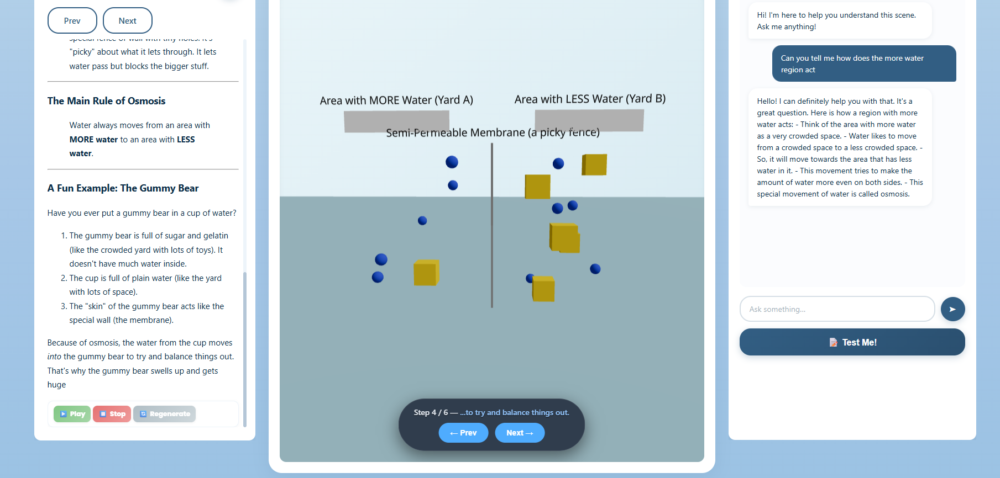

# 🧠 Mimic — AI-Powered 3D Visual Copilot  
*A neuro-inclusive, multimodal learning assistant.*

Mimic is an intelligent 3D visualization companion designed to help users — especially neurodivergent thinkers — understand complex concepts through **interactive 3D scenes**, **simplified explanations**, **soothing voice narration**, **adaptive chat guidance**, and **AI-generated quizzes**.

<p align="center" style="margin-top:-20px; margin-bottom:-15px;">
  
</p>

## 👥 Contributors

This project was made possible by the **creativity, teamwork, and dedication** of our amazing team 🚀  

<table align="center">
  <tr>

   <td align="center" style="padding: 10px;">
      <a href="https://github.com/NothingADSR123" style="text-decoration:none; color:inherit;">
        
        <br/><b>Aditya</b>
      </a>
    </td>

   <td align="center" style="padding: 10px;">
      <a href="https://github.com/ShreyaSriranga" style="text-decoration:none; color:inherit;">
        
        <br/><b>Shreya Sriranga</b>
      </a>
    </td>

  <td align="center" style="padding: 10px;">
      <a href="https://github.com/SpaceIsVoidless" style="text-decoration:none; color:inherit;">
        
        <br/><b>Aaron</b>
      </a>
    </td>

   <td align="center" style="padding: 10px;">
      <a href="https://github.com/chayahg" style="text-decoration:none; color:inherit;">
        
        <br/><b>Chaya</b>
      </a>
    </td>

  </tr>
</table>

⚡️ Each member contributed significantly — from building the dashboard, implementing multimodal AI flows, designing accessible UI, creating the 3D pipeline, and developing backend APIs.


---

## ✨ Features

### 🔹 AI 3D Scene Generation  
Enter any concept, and Mimic generates a **JSON Scene Graph** using Gemini, then renders it into an **interactive 3D scene** using React Three Fiber.

### 🔹 Step-by-Step Visual Animation  
Navigate complex processes using **Prev / Next** steps inside the 3D scene.

### 🔹 Simple Cognitive-Friendly Explanation  
Each concept includes a **clear, simplified explanation** optimized for reduced cognitive load.

### 🔹 Soothing Voice Narration (AudioBot)  
A calming female voice reads the explanation aloud via Text-to-Speech.

### 🔹 Chat with Mimic (AI Copilot)  
Ask follow-up questions and explore deeper understanding.

### 🔹 AI-Generated Concept Quiz  
Mimic tests your understanding with automatically generated quizzes — and re-explains wrong answers.

### 🔹 Modern Neurodivergent-Friendly UI  
Soft visuals • calming color palette • clean layout • reduced sensory overload.

---
## 🖼️ Screenshots

### 🌐 Homepage  
<p align="center">
  
</p>

---

### 🧠 Dashboard  
<p align="center">
  
</p>
  
<p align="center">
  
</p>


## 🏗️ Tech Stack

### **Frontend**
- React.js  
- React Three Fiber (R3F)  
- Three.js  
- ReactMarkdown  
- Axios  
- Custom CSS

### **Backend**
- Node.js  
- Express.js  
- Gemini API (Scene Graph, Chat, Quiz, Explanations)  
- Google / Gemini TTS  
- Custom AI Services  

---

## 🔌 API Endpoints

| Method | Endpoint | Description |
|--------|----------|-------------|
| POST | `/api/ai/generate-scene` | Generates scene graph + explanation |
| POST | `/api/ai/chat` | Chatbot response |
| POST | `/api/ai/quiz` | Creates quiz |
| POST | `/api/ai/re-explain` | Re-explanation for incorrect answers |
| POST | `/api/tts` | Audio generation (TTS) |

---


## 📁 Project Structure

```
Mimic/
├── client/
│   ├── src/
│   │   ├── assets/
│   │   ├── components/
│   │   │   ├── 3d/
│   │   │   └── AudioBot.jsx
│   │   ├── pages/
│   │   │   ├── MimicDashboard.jsx
│   │   │   └── DashboardPage.jsx (legacy)
│   │   ├── styles/
│   │   ├── App.jsx
│   │   └── main.jsx
│   └── package.json
│
├── server/
│   ├── routes/
│   ├── controllers/
│   ├── services/
│   ├── index.js
│   └── package.json
│
└── README.md
```


---

## 🛠️ Setup Instructions

### 🔧 Prerequisites
- Node.js (v18+)  
- npm or yarn  
- Gemini API Key  
- TTS Credentials (Google / Gemini Text-to-Speech)


---

## 🚀 Frontend Setup

1️⃣ Clone the repository
```bash
git clone https://github.com/NothingADSR123/Kodikon5.0_Mimic.git
```
2️⃣ Navigate to the frontend directory
```
cd Kodikon5.0_Mimic/client
```
3️⃣ Install dependencies
```
npm install
```
4️⃣ Start the development server
```
npm start
```
The application will be available at:
👉 http://localhost:3000


## 🖥️ Backend Setup

1️⃣Navigate to the backend directory
```bash
cd Kodikon5.0_Mimic/server
```
2️⃣ Install dependencies
```
npm install
```
3️⃣ Create a .env file in the backend directory with the following variables:
```
PORT=5001
GEMINI_API_KEY= your_api_key
```
4️⃣ Start the backend server
```
npm run dev
```
The API will be available at:
👉 http://localhost:5001

---

## 🧪 Sample API Test
```
curl -X POST http://localhost:5001/api/ai/generate-scene \
  -H "Content-Type: application/json" \
  -d '{ "prompt": "water cycle" }'
```

## 🫴🏻 Contributing

1. Fork the repository  
2. Create a new branch  
3. Commit your changes  
4. Push your branch  
5. Open a Pull Request  


---

## 📜 License

This project is licensed under the **MIT License**.


---

## 🫶🏻 Acknowledgements

- Gemini API  
- Google Text-to-Speech  
- React Three Fiber  
- Three.js  
- Express.js  
- Node.js  

